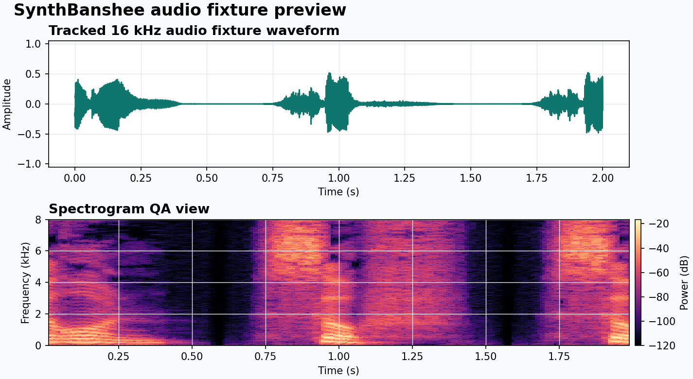
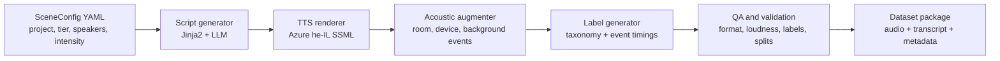

# SynthBanshee

[](https://github.com/DataHackIL/SynthBanshee/actions/workflows/ci.yml)
[](LICENSE)


Created by [Shay Palachy Affek](http://www.shaypalachy.com/).

**SynthBanshee** is a config-driven pipeline for generating synthetic Hebrew audio datasets for
DataHack's [AVDP](https://datahack.org.il) (Audio Violence Dataset Project). It turns structured
scene YAML into Hebrew dialogue, rendered speech, acoustic variants, taxonomy labels, QA reports,
and dataset packages that AI teams can use for early model development.

The repository supports two sensitive AI-safety product contexts: **She-Proves**, focused on
domestic-violence incident detection research, and **Elephant in the Room** (`הפיל שבחדר`), focused
on threat detection in social-work offices. Synthetic-to-real gap is expected and documented; real
actor and field-data pipelines remain separate.



## At a Glance

| Field | Value |
|---|---|
| Role | Synthetic Hebrew audio dataset generation for AVDP |
| Main inputs | `SceneConfig` YAML, speaker profiles, run configs, script templates |
| Main outputs | `.wav`, `.txt`, `.json`, `.jsonl`, manifests, split files, QA reports |
| Language | Hebrew (`he`, rendered with `he-IL` TTS voices) |
| Audio contract | 16 kHz, mono, 16-bit PCM, `-1.0 dBFS` peak ceiling, silence padding |
| Current status | Phase 0 and Phase 1 complete; Tier A baseline generation delivered |
| Packaged examples | 3 example scene configs, 8 run configs, 6 packaged speakers, 4 tracked WAV fixtures |

## Pipeline



Each generated clip is reproducible from config and seed. Tier A renders clean TTS, Tier B adds room
and device simulation, and Tier C adds hard negatives and confusors for robustness testing.

## Output Surface

| Artifact | Purpose |
|---|---|
| `{clip_id}.wav` | Rendered 16 kHz mono PCM scene audio |
| `{clip_id}.txt` | Hebrew transcript for the rendered scene |
| `{clip_id}.json` | Clip metadata, taxonomy-derived `has_violence`, speakers, duration, and provenance |
| `{clip_id}.jsonl` | Time-aligned strong labels generated from script structure and augmentation logs |
| Manifest and split files | Dataset inventory, train/validation/test assignment, and batch-level provenance |
| QA reports | Format, loudness, duration, taxonomy, split hygiene, and generated-asset checks |

The preview image above is generated from a tracked 16 kHz test fixture, not from a released dataset
sample. It shows the kind of waveform and spectrogram view used for quick audio QA.

## Dataset Tiers

| Tier | Description | Target per project |
|---|---|---|
| A | Clean TTS with no acoustic augmentation | 1,000 clips |
| B | Room simulation, device profile, and background noise | 2,000 clips |
| C | Hard negatives and confusors, including de-escalating arguments and ambient sounds | 1,000 clips |

Both product contexts receive the full tier stack:

- **She-Proves**: 3-6 minute apartment scenes with pre-incident, incident, and aftermath windows.
- **Elephant in the Room**: 1-4 minute clinic or welfare-office scenes for local threat detection.

## Label Taxonomy

Labels use a three-level hierarchy. `has_violence` in clip metadata and manifests is a derived
convenience field computed from the taxonomy, not an independent label.

| Level | Examples |
|---|---|
| Violence typology | `SV`, `IT`, `NEG`, `NEU` |
| Tier 1 event category | `PHYS`, `VERB`, `DIST`, `ACOU`, `EMOT`, `NONE` |
| Tier 2 event subtype | `PHYS_HARD`, `VERB_THREAT`, `DIST_SCREAM`, `ACOU_BREAK` |

Full taxonomy: [`synthbanshee/data/taxonomy.yaml`](synthbanshee/data/taxonomy.yaml).

## Quick Start

```bash
# Install locally with Python 3.11+ and uv.
uv pip install -e .

# Generate a single clip from a scene config.
synthbanshee generate --config configs/examples/scene_she_proves_IT_example.yaml

# Generate a Tier A She-Proves batch from a run config.
synthbanshee generate-batch \
  --run-config configs/run_configs/tier_a_500_she_proves.yaml \
  --output-dir data/he

# Run automated QA on a dataset directory.
synthbanshee qa-report data/he

# Validate an existing clip.
synthbanshee validate data/he/clip_001.wav
```

Live generation requires provider credentials in your environment or local `.env` file:

```bash
AZURE_TTS_KEY=...
AZURE_TTS_REGION=...
ANTHROPIC_API_KEY=...
```

Do not commit provider keys, generated private datasets, or real-data artifacts.

## Safety and Data Boundary

SynthBanshee is a synthetic-data generator for research and model-development workflows. Generated
clips are not evidence, user recordings, or a substitute for real validation data. They are designed
to widen scenario coverage while actor-recording and real-data pipelines are handled separately.

Sensitive context should remain explicit in configs and docs, but public-facing materials should not
overstate model readiness, legal usefulness, or field performance.

## Current Status

| Phase | Deliverable | Status |
|---|---|---|
| 0 | Single spec-compliant clip end to end | Done |
| 1 | Script templates, multi-speaker TTS, LLM generation, batch generation, QA suite | Done |
| 2 | 1,000-1,500 Tier B clips per project | Planned |
| 3 | 4,000 clips per project across all tiers | Planned |

## Documentation

| Document | Contents |
|---|---|
| [`docs/spec.md`](docs/spec.md) | Audio format, file naming, label schema, and IAA protocol |
| [`docs/implementation_plan.md`](docs/implementation_plan.md) | Phased milestones, module map, and API cost estimates |
| [`docs/design_approaches.md`](docs/design_approaches.md) | Design decisions and rationale |
| [`CLAUDE.md`](CLAUDE.md) | Agent context guide for pipeline constraints and conventions |

## Credits

Created by [Shay Palachy Affek ](http://www.shaypalachy.com/) [[GitHub](https://github.com/shaypal5)]
